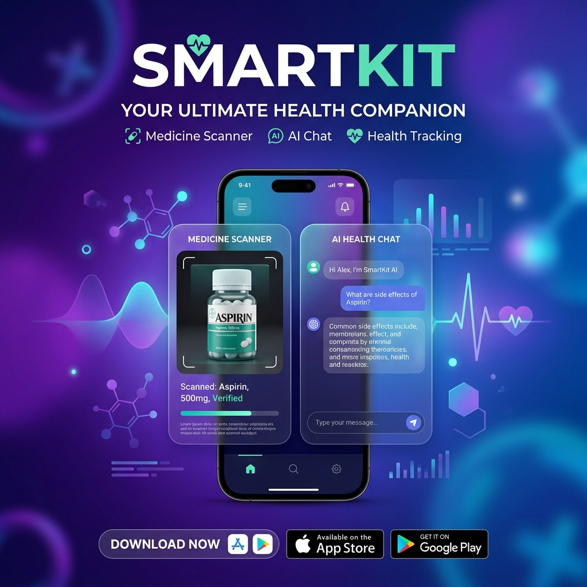

# 🏥 SmartKit — Your Ultimate Health Companion



[](https://flutter.dev)
[](https://firebase.google.com)
[](https://deepmind.google/technologies/gemini/)
[](https://opensource.org/licenses/MIT)

**SmartKit** is a premium, AI-driven mobile application designed to simplify medication management. From real-time barcode scanning to intelligent health assistance, SmartKit ensures you never miss a dose and always have the right information at your fingertips.

---

## ✨ Key Features

### 🔍 AI-Powered Medicine Scanner
- **Instant Identification**: Scan any medicine barcode or Data Matrix (RU "Честный ЗНАК") to automatically identify the product.
- **Cascaded Lookup**: Uses a robust logic flow:
  1. **OpenFDA**: For international medication data.
  2. **OpenFoodFacts**: Global barcode database.
  3. **Local Database**: Optimized for popular medications (30+ built-in records).
- **Damage Recovery**: Built-in logic for reporting missing items and manual entry fallback.

### 🤖 Intelligent AI Assistant (Gemini)
- **Health Chat**: Ask about side effects, dosage, or interactions.
- **Kit Builder**: Tell the AI your situation (e.g., "I'm going to the mountains for 3 days"), and it will suggest a custom First Aid kit.
- **Smart Analysis**: Get personalized health recommendations based on your current medicine cabinet.

### ⏰ Smart Reminders & Notifications
- **Dose Tracking**: Never miss a medication with automated push notifications.
- **Visual Dashboard**: A clean, intuitive overview of your daily health schedule.

### 💎 Premium Design System
- **Glassmorphism**: Modern, sleek UI with frosted glass effects.
- **Dynamic Themes**: Full support for Dark and Light modes.
- **Micro-animations**: Smooth transitions and animated scanning laser for a tactile feel.

---

## 🛠 Tech Stack

- **Frontend**: [Flutter](https://flutter.dev) (Dart)
- **Backend**: [Firebase](https://firebase.google.com) (Authentication, Cloud Firestore)
- **AI**: [Google Gemini Pro API](https://ai.google.dev/)
- **Scanning**: [mobile_scanner](https://pub.dev/packages/mobile_scanner)
- **State Management**: Provider / ChangeNotifier

---

## 🚀 Getting Started

### Prerequisites
- Flutter SDK (latest stable version)
- A Firebase project
- A Gemini API Key from [Google AI Studio](https://aistudio.google.com/)

### Installation

1. **Clone the repository**:
   ```bash
   git clone https://github.com/Just2Alim/SmartKit.git
   cd smartkit
   ```

2. **Install dependencies**:
   ```bash
   flutter pub get
   ```

3. **Configure Environment Variables**:
   Create a file `lib/core/constants/api_keys.dart` based on the example:
   ```dart
   // lib/core/constants/api_keys.dart
   class ApiKeys {
     static const String geminiApiKey = 'YOUR_GEMINI_API_KEY';
     static const String firebaseWebApiKey = 'YOUR_FIREBASE_WEB_API_KEY';
   }
   ```

4. **Run the application**:
   ```bash
   flutter run
   ```

---

## 📂 Project Structure

```text
lib/
├── core/               # App configuration, themes, constants, and services
│   ├── services/       # AI (Gemini/Ollama), Auth, Barcode, etc.
│   └── theme/          # Premium design system tokens
├── features/           # Feature-based architecture
│   ├── ai/             # AI Chat and Kit Builder logic
│   ├── auth/           # Login, Signup, and Onboarding
│   ├── dashboard/      # Main UI and daily overview
│   └── medicine/       # Scanner and medicine management
└── main.dart           # App entry point
```

---

## 🗺 Roadmap
- [ ] Offline AI support (Local LLM via Ollama).
- [ ] Advanced Drug-to-Drug interaction checker.
- [ ] Family sharing features.
- [ ] Integration with Apple Health / Google Fit.

---

## 📜 License
This project is licensed under the MIT License - see the [LICENSE](LICENSE) file for details.

## 🤝 Contact
**Alim** - [GitHub](https://github.com/Just2Alim)

---
*Developed with ❤️ for a healthier future.*
