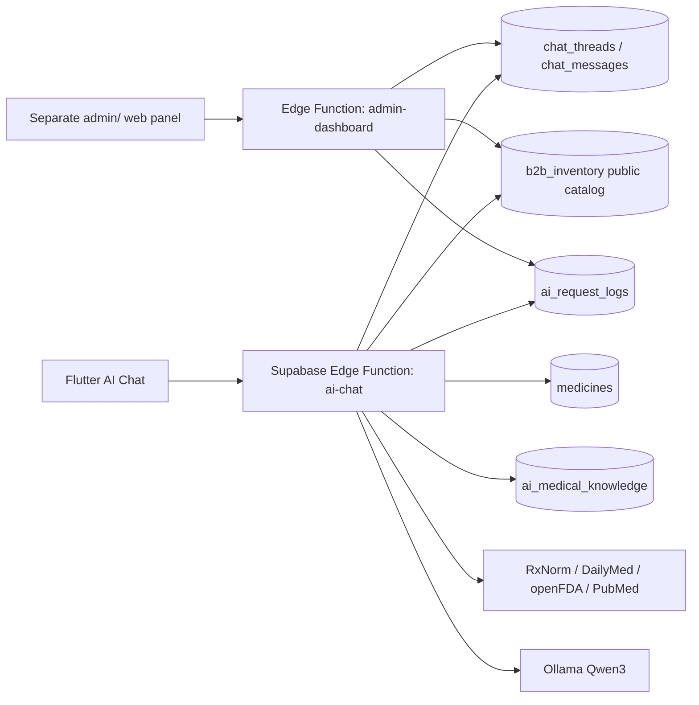

# SmartKit - AI рекомендации, источники и админ-мониторинг

## Цель

AI должен помогать шире, чем только по домашней аптечке: объяснять общие
безрецептурные категории, учитывать аптечный каталог, показывать конкретные
товарные карточки для корзины и сохранять контекст пользователя. При этом AI не
должен становиться врачом: он не ставит диагноз, не назначает лечение, не дает
персональные дозировки и не продвигает рецептурные препараты.

## Реализованная архитектура



## AI chat

- `ai-chat` принимает JWT пользователя и `message`/`threadId`.
- Если `threadId` не передан, создается новый `chat_threads`.
- Последние сообщения из `chat_messages` добавляются в prompt, поэтому контекст
  сохраняется между выходами из приложения.
- Ответ AI сохраняется в `chat_messages` вместе с `sources` и
  `productSuggestions`.
- Каждая попытка пишется в `ai_request_logs`: prompt, response, model,
  latency, sources, product suggestions, status/error.

## Источники и база знаний

Локальная база:

- `ai_sources` - реестр источников.
- `ai_medical_knowledge` - короткие безопасные справочные записи по темам и
  действующим веществам.

Внешние источники, вызываемые сервером:

- RxNorm - нормализованные названия лекарств.
- DailyMed - актуальные SPL drug labels.
- openFDA Drug Label - label sections для prescription/OTC.
- PubMed через NCBI E-utilities - заголовки релевантных публикаций.

Важно: источники используются как справочный контекст, а не как медицинское
назначение. Ответы всегда должны содержать предупреждение про инструкцию,
противопоказания и врача/фармацевта при симптомах.

## Карточки товаров в чате

Edge Function ранжирует публичный `b2b_inventory` по словам запроса и безопасным
категориям. В ответ возвращается `productSuggestions`.

Flutter показывает карточки прямо под AI-ответом:

- название, категория, дозировка/упаковка;
- цена и остаток;
- кнопка добавления в корзину;
- защита от добавления больше текущего остатка.

Рецептурные/опасные категории не добавляются автоматически и получают штраф в
ранжировании.

## Админ-панель

Папка: `admin/`.

Панель полностью отдельная от Flutter-приложения:

- статический `index.html`;
- Supabase JS client;
- вход по email/password;
- вызов `admin-dashboard`.

Доступ проверяется сервером через `app_admins`. Миграция автоматически добавляет
`b2b@mail.ru`, если профиль существует.

Панель показывает:

- пользователей и роли;
- AI запросы за сегодня;
- ошибки и среднюю задержку;
- использование источников;
- последние prompt/response пары;
- предложенные товары;
- B2B каталог, публичные товары, низкие остатки и продажи за 7 дней.

## Команды

Применить миграции:

```bash
npx supabase db push --linked --password "$SUPABASE_DB_PASSWORD"
```

Деплой функций:

```bash
npx supabase functions deploy ai-chat admin-dashboard \
  --project-ref "$SUPABASE_PROJECT_REF" \
  --use-api
```

Запуск админки:

```bash
python3 -m http.server 8090 --directory admin
```

Открыть:

```text
http://localhost:8090
```

## Следующие улучшения

- добавить ручную разметку качества AI-ответов в `ai_request_logs`;
- добавить фильтры по пользователю, статусу, источнику и времени;
- вынести справочник `ai_medical_knowledge` в отдельный admin CRUD;
- добавить named Cloudflare Tunnel или нормальный хостинг для постоянной
  админ-ссылки.
