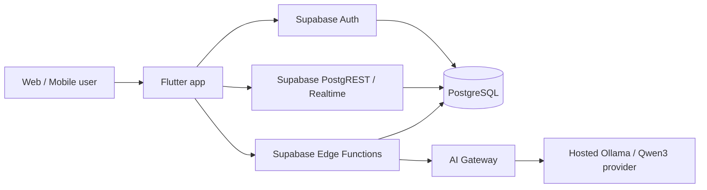

# SmartKit - ТЗ PostgreSQL/Supabase backend

## 1. Цель

SmartKit должен работать как публичный web/mobile продукт: пользователи входят через Supabase Auth, данные хранятся в PostgreSQL, команда бизнеса работает в общих организациях, а AI-чат доступен через серверный gateway.

## 2. Архитектура



## 3. Backend-состав

- `profiles` - профиль пользователя и роль.
- `organizations` - бизнес-аккаунты аптек/складов.
- `organization_members` - командный доступ.
- `medicines`, `family_members`, `reminders` - B2C данные.
- `b2b_locations`, `b2b_inventory`, `b2b_sales`, `b2b_sale_items`, `b2b_activities` - B2B контур.
- `barcode_products` - обучаемый справочник штрих-кодов.
- `chat_threads`, `chat_messages` - история AI-чатов.
- `ai_sources`, `ai_medical_knowledge` - управляемые справочные источники и
  локальная база знаний для AI.
- `ai_request_logs` - observability-журнал prompt/response, источников,
  карточек товаров, задержки, модели и ошибок.
- `app_admins` - отдельный доступ к web-админке мониторинга.

## 4. Доступы

- B2C пользователь читает и меняет только свои записи.
- B2B данные принадлежат организации.
- Командные роли: `owner`, `admin`, `pharmacist`, `analyst`.
- Owner/admin могут приглашать сотрудников по email через RPC
  `invite_organization_member_by_email`.
- Pending invite автоматически активируется при регистрации пользователя с тем же
  email.
- Публичный магазин читает только `b2b_inventory.is_public = true`.
- Изменение остатков при checkout выполняется через RPC `record_shop_checkout`.
- Все таблицы защищены RLS.

## 5. Edge Functions

- `health` - smoke-test backend.
- `ai-chat` - общий AI gateway с сохранением контекста, источниками,
  карточками товаров и логированием.
- `business-analysis` - B2B AI анализ с чтением данных организации из PostgreSQL.
- `admin-dashboard` - агрегированный мониторинг AI, пользователей, каталога и
  продаж для отдельной web-админки.

Secrets для функций:

```bash
supabase secrets set \
  OLLAMA_BASE_URL=https://your-ollama-proxy.example.com \
  OLLAMA_MODEL=qwen3:latest \
  OLLAMA_API_KEY=$OLLAMA_PROXY_TOKEN
```

`SUPABASE_URL`, `SUPABASE_ANON_KEY` и `SUPABASE_SERVICE_ROLE_KEY` в hosted
Edge Functions являются зарезервированными Supabase secrets и доступны
автоматически.

## 6. Flutter

Flutter запускается с локальным `.env`:

```bash
flutter run -d chrome --dart-define-from-file=.env
```

Сделано в коде:

- Supabase bootstrap в `main.dart`.
- `AppConfig` для `--dart-define`.
- Supabase Auth service.
- JSON-модели без SDK-specific document/timestamp типов.
- B2C репозитории на Supabase.
- B2B репозитории на organization-based PostgreSQL.
- B2B Team screen читает `organization_members`, показывает роли/статусы и
  управляет доступом сотрудников.
- Activity History screen показывает полный журнал `b2b_activities` с
  фильтрами по типу события.
- Checkout через transactional RPC.
- AI через server-side gateway с offline fallback.
- Qwen3 используется как дефолтная Ollama-модель (`qwen3:latest`).
- AI-чат восстанавливает последний `chat_threads` и показывает сохраненные
  `chat_messages`.
- AI-ответ может содержать `productSuggestions`; Flutter показывает карточки
  товаров и кнопку добавления в корзину.

## 7. AI safety и источники

AI больше не ограничен только домашней аптечкой. Он может объяснять
безрецептурные категории, использовать публичный каталог и ссылаться на
справочные источники. Ограничения остаются жесткими:

- не ставить диагноз;
- не назначать персональные дозировки и курсы;
- не рекомендовать антибиотики, гормоны, сердечные, диабетические и другие
  рецептурные препараты без врача;
- при экстренных симптомах направлять на 103/112;
- для детей, беременности, ГВ, хронических болезней, аллергий и сложных случаев
  направлять к врачу/фармацевту;
- всегда просить проверить инструкцию, противопоказания и срок годности.

## 8. Командная разработка

Все разработчики получают:

- доступ к GitHub repository;
- доступ к Supabase staging project;
- `.env.example`;
- права в Supabase по роли;
- миграции через PR в `supabase/migrations`;
- Edge Functions через PR в `supabase/functions`.

Production secrets не коммитятся и не отправляются в чат.

## 9. Definition of Done

- Приложение собирается без старого backend SDK.
- Auth работает через Supabase.
- B2C и B2B данные читаются из PostgreSQL.
- B2B-команда работает через `organization_members`.
- Checkout атомарно списывает склад.
- AI-чат доступен через серверный endpoint.
- AI-чат сохраняет контекст пользователя.
- AI может возвращать карточки товаров из каталога для корзины.
- Отдельная web-админка показывает мониторинг AI и приложения.
- Новый разработчик запускает проект по README и `.env.example`.
